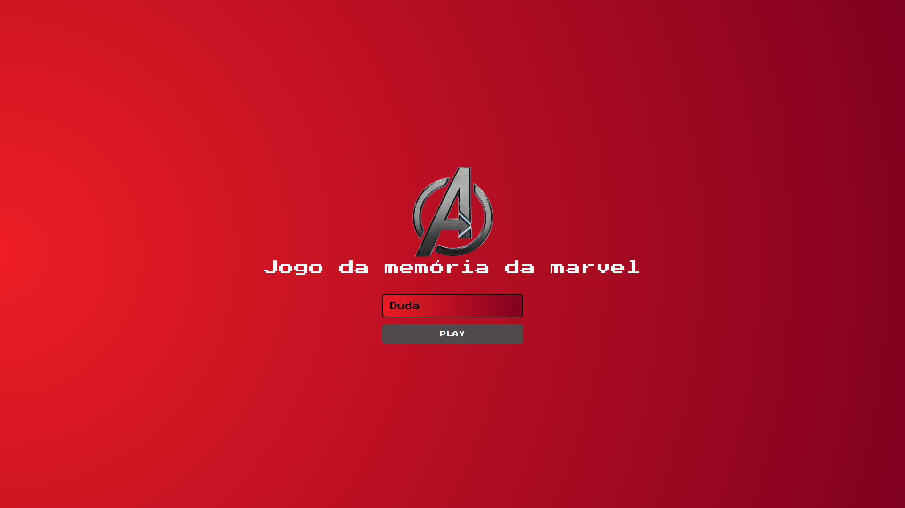
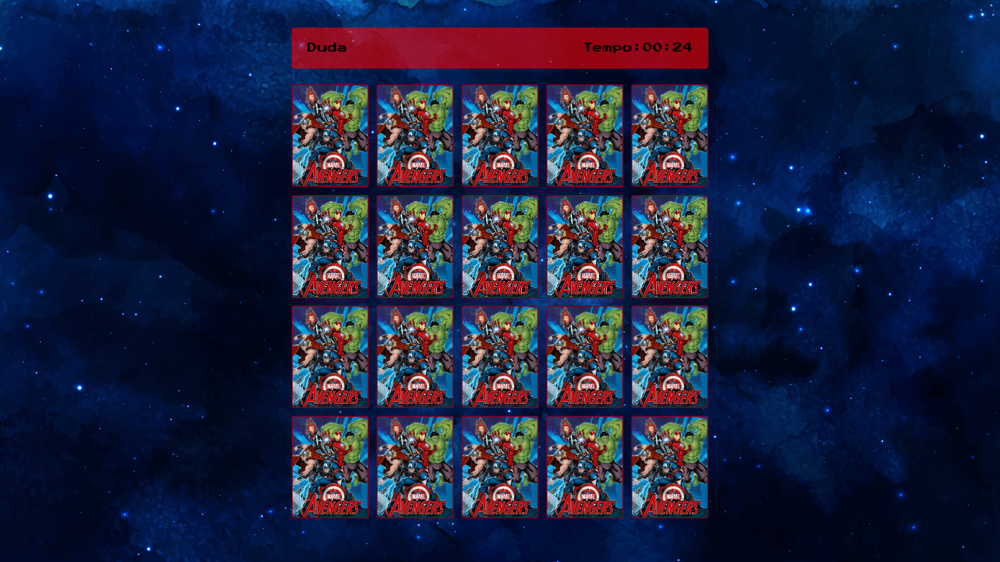

## Jogo da Memória dos Vingadores 🎮
Este é um jogo da memória simples e divertido com o tema dos Vingadores, desenvolvido utilizando HTML, CSS e JavaScript puro. 

-----

📸 Screenshots

-----

### 🚀 Como Jogar

1.  **Acesse o jogo online:** [Link](https://mariaesmdev.github.io/Jogo-da-memoria-marvel/)
2.  **Clique nas cartas** para revelá-las.
3.  **Encontre pares** de cartas idênticas para eliminá-las do tabuleiro.
4.  O jogo termina quando todos os pares forem encontrados\!

-----

### ✨ Funcionalidades

  * **Tema Vingadores:** Cartas personalizadas com seus heróis preferidos para uma experiência imersiva.
  * **Design Responsivo:** Jogue em diversos dispositivos, como desktops, tablets e celulares, adaptando-se a qualquer tela.
  * **Simples e Intuitivo:** Uma interface fácil de entender e jogar, perfeita para todas as idades.

-----

### 🛠️ Tecnologias Utilizadas

  * **HTML5:** Usado para estruturar semanticamente o conteúdo do jogo.
  * **CSS3:** Responsável pela estilização visual e pelo design responsivo, garantindo uma boa aparência em qualquer dispositivo.
  * **JavaScript:** Implementa toda a lógica do jogo, incluindo embaralhar as cartas, verificar pares e controlar a interatividade.

-----

